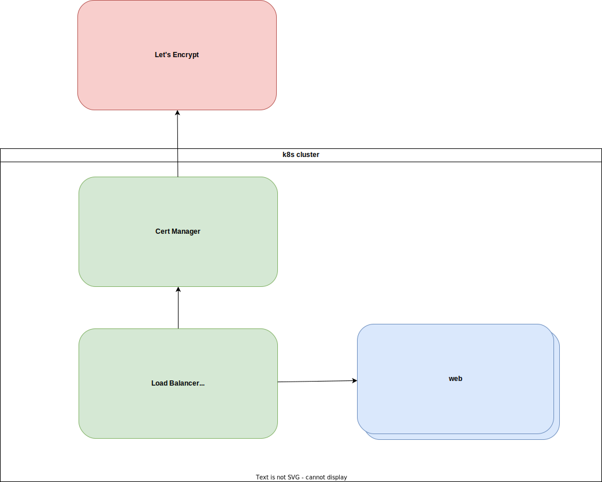

# Design

# Implementation Decisions

- We decided to use `kubectl` provider despite it being less reliable, because
  - we can't use the `kubernetes` provider without a cluster already runing
    - which forces us to either to apply unchecked manifests (as `kubectl` does)
    - or have different TF states "before cluster created" and "after cluster created" and use `kubernetes` provider configured via HCL
- TODO: have a way to detect k8s objects which don't appear in the configuration
- TODO: how to tell what to and not to create with `kubernetes` provider
- TODO: how to deal with outputs?
  - from ingress to DNS records
- TODO: check that we can get a feedback from `kubectl` in case of errors
- specify the only environment as an environment
